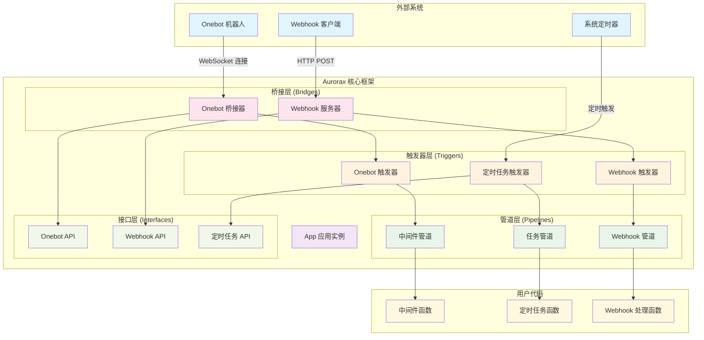

# Aurorax 架构概览

## 系统架构图

## 核心概念

### 1. 触发器 (Triggers)
- **OnebotTrigger**: 监听 Onebot 事件，触发中间件管道
- **WebhookTrigger**: 监听 HTTP Webhook 请求，触发 Webhook 管道
- **CronTrigger**: 基于 cron 表达式定时触发任务管道

### 2. 管道 (Pipelines)
- **MiddlewarePipeline**: 处理 Onebot 事件的中间件链
- **JobPipeline**: 执行定时任务
- **WebhookPipeline**: 处理 Webhook 请求

### 3. 桥接器 (Bridges)
- **OnebotBridge**: 与 Onebot 机器人的通信桥接
- **WebhookServer**: HTTP 服务器，接收 Webhook 请求

### 4. 接口 (Interfaces)
- 定义各种事件和 API 的数据结构
- 提供类型安全的接口定义

## 数据流向

1. **Onebot 事件流**: Onebot → OnebotBridge → OnebotTrigger → MiddlewarePipeline → 用户中间件
2. **Webhook 事件流**: Webhook客户端 → WebhookServer → WebhookTrigger → WebhookPipeline → 用户处理函数
3. **定时任务流**: 系统定时器 → CronTrigger → JobPipeline → 用户任务函数

## 设计特点

- **模块化设计**: 各组件职责清晰，松耦合
- **管道模式**: 支持中间件链式处理
- **事件驱动**: 基于事件触发的异步处理
- **类型安全**: 完整的 TypeScript 类型定义
- **可扩展性**: 易于添加新的触发器和管道类型
