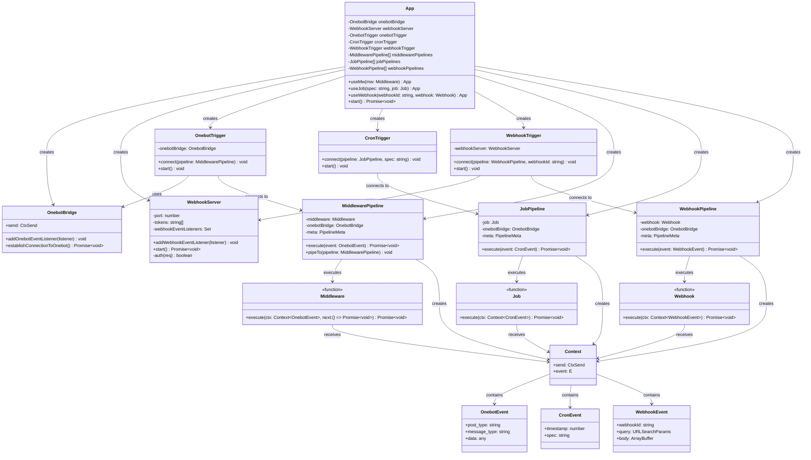

# 组件关系图

## 详细组件关系图

## 组件职责说明

### 核心应用类 (App)
- **职责**: 应用程序的主入口，协调各个组件
- **功能**: 
  - 创建和管理所有桥接器、触发器、管道
  - 提供 `useMw()`, `useJob()`, `useWebhook()` 方法注册用户代码
  - 启动整个应用程序

### 桥接器层 (Bridges)
- **OnebotBridge**: 
  - 与 Onebot 机器人建立 WebSocket 连接
  - 处理 Onebot API 调用和事件接收
  - 提供 `send` 方法供用户代码调用 Onebot API

- **WebhookServer**:
  - 提供 HTTP 服务器接收 Webhook 请求
  - 支持 Token 认证
  - 将请求转换为 WebhookEvent 并分发给触发器

### 触发器层 (Triggers)
- **OnebotTrigger**: 监听 Onebot 事件，触发中间件管道链
- **WebhookTrigger**: 监听 Webhook 事件，触发对应的 Webhook 管道
- **CronTrigger**: 基于 cron 表达式定时触发任务管道

### 管道层 (Pipelines)
- **MiddlewarePipeline**: 
  - 执行中间件链
  - 支持 `pipeTo()` 方法链式连接多个中间件
  - 提供 `next()` 机制控制执行流程

- **JobPipeline**: 执行定时任务，无链式结构
- **WebhookPipeline**: 执行 Webhook 处理函数

### 用户代码接口
- **Middleware**: 中间件函数，接收 Onebot 事件上下文
- **Job**: 定时任务函数，接收 Cron 事件上下文  
- **Webhook**: Webhook 处理函数，接收 Webhook 事件上下文

### 上下文对象 (Context)
- 为每种类型的用户代码提供统一的上下文接口
- 包含 `send` 方法用于调用 Onebot API
- 包含 `event` 对象提供事件数据

## 数据流关系

1. **事件接收**: 外部系统 → 桥接器 → 触发器
2. **管道执行**: 触发器 → 管道 → 用户代码
3. **API 调用**: 用户代码 → 上下文 → OnebotBridge → Onebot

## 扩展点

- **新增触发器**: 实现新的 Trigger 类，在 App 中注册
- **新增管道**: 实现新的 Pipeline 类，支持特定类型的事件处理
- **新增桥接器**: 实现新的 Bridge 类，支持其他外部系统集成
