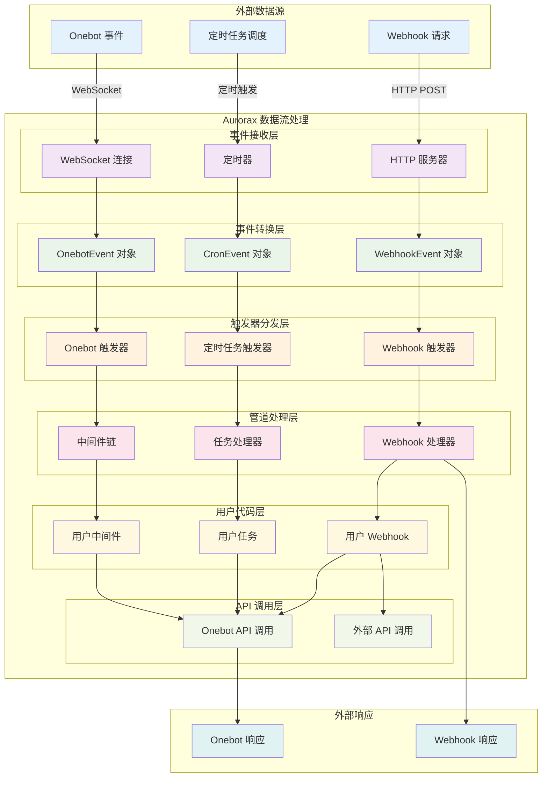
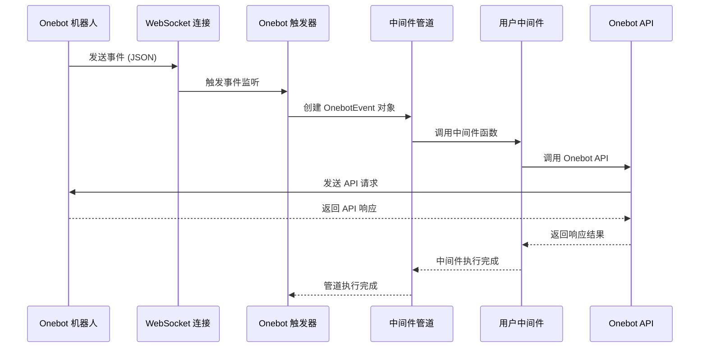
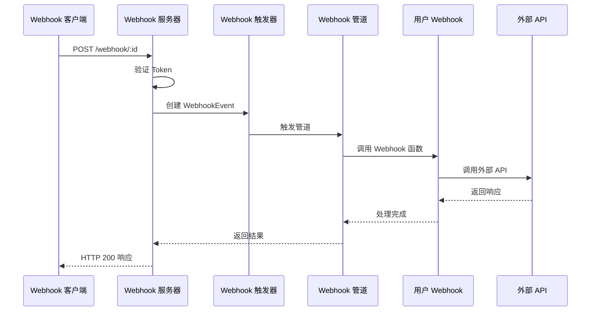
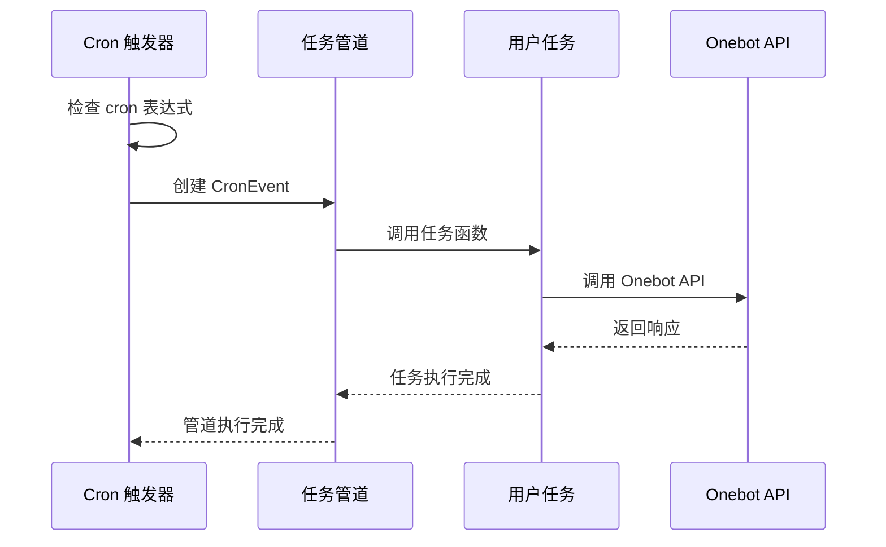
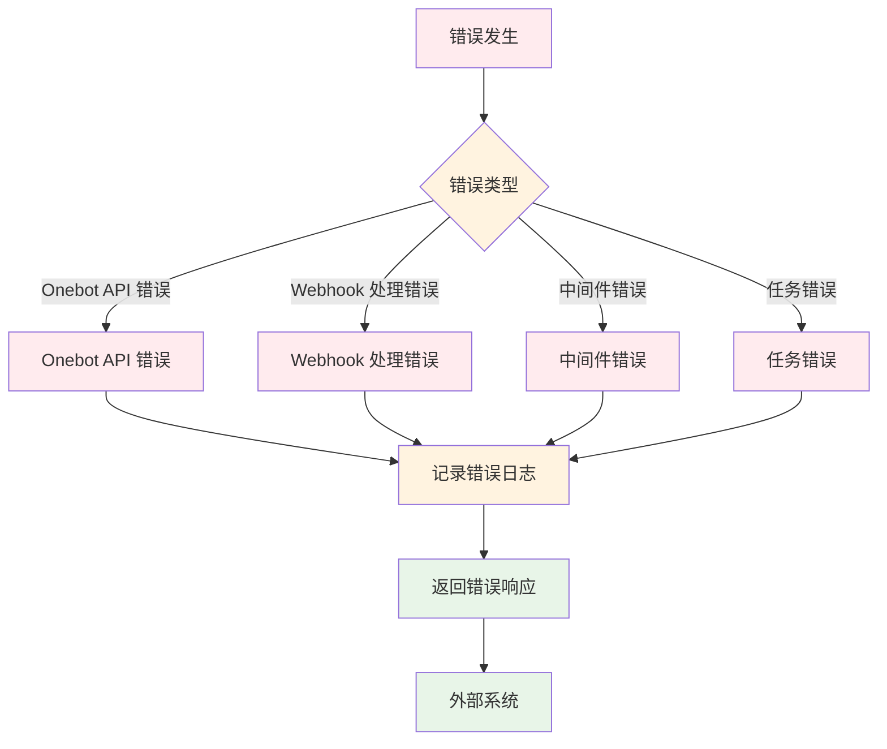

# 数据流图

## 整体数据流图



## 详细数据流说明

### 1. Onebot 事件流



### 2. Webhook 事件流



### 3. 定时任务流



## 数据结构转换

### Onebot 事件转换
```typescript
// 原始 WebSocket 消息
{
  "post_type": "message",
  "message_type": "private",
  "user_id": 123456,
  "message": "Hello"
}

// 转换为 OnebotEvent
interface OnebotEvent {
  post_type: string
  message_type: string
  user_id: number
  message: string
  // ... 其他字段
}
```

### Webhook 事件转换
```typescript
// HTTP 请求
POST /webhook/my-webhook?param=value
Authorization: Bearer token123
Content-Type: application/json

{"data": "example"}

// 转换为 WebhookEvent
interface WebhookEvent {
  webhookId: string        // "my-webhook"
  query: URLSearchParams   // {param: "value"}
  body: ArrayBuffer        // {"data": "example"}
}
```

### Cron 事件转换
```typescript
// 定时触发
cron: "0 9 * * *"  // 每天 9 点

// 转换为 CronEvent
interface CronEvent {
  timestamp: number  // 当前时间戳
  spec: string       // "0 9 * * *"
}
```

## 错误处理流



## 性能优化点

1. **异步处理**: 所有 I/O 操作都是异步的，避免阻塞
2. **管道链式**: 中间件支持链式处理，提高复用性
3. **事件驱动**: 基于事件触发，避免轮询
4. **连接复用**: WebSocket 连接复用，减少连接开销
5. **错误隔离**: 各管道独立处理错误，互不影响
