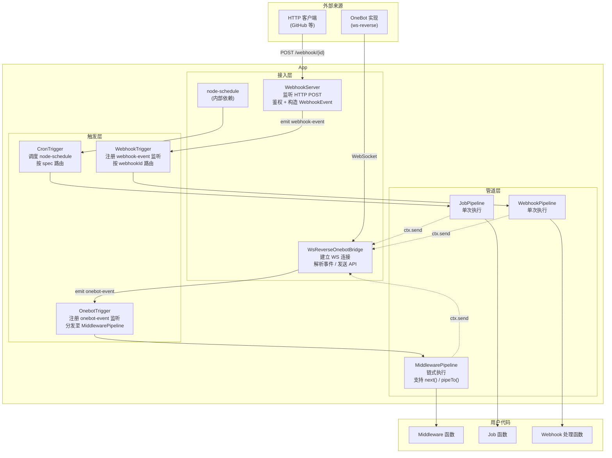

# 架构概览

## 整体结构

Aurorax 由三条独立的事件处理通道组成，分别对应 OneBot 消息、定时任务和 Webhook 请求。每条通道的结构相同：**外部来源 → Bridge/Server（接入层）→ Trigger（触发层）→ Pipeline（管道层）→ 用户代码**。



> `ctx.send` 由管道从 `OnebotBridge.send` 取得后注入 `ctx`，三条通道共用同一个 `send` 实现。

## 各层职责

### 接入层

| 组件 | 职责 |
|------|------|
| `WsReverseOnebotBridge` | 建立 WebSocket 连接；区分入站消息（OneBot 事件 vs API 响应）；管理 API 回调 |
| `WebhookServer` | 监听 HTTP；鉴权（`Authorization` 请求头）；构造 `WebhookEvent`；通过 EventEmitter 分发 |
| `node-schedule`（内部） | `CronTrigger` 的底层调度依赖，不直接暴露给外部 |

### 触发层

触发层持有管道列表，每条触发通道的行为略有差异：

- **`OnebotTrigger`**：通过 `queueUntil` 缓冲在 `start()` 前到达的事件，确保不丢弃早期事件
- **`WebhookTrigger`**：在 `start()` 时才注册 `webhook-event` 监听，按 `webhookId` 路由到对应管道
- **`CronTrigger`**：在 `start()` 时为每个唯一 spec 注册一个 `scheduleJob`，按 `spec` 路由

三者均实现 `Trigger<E>` 接口，`connect()` 阶段连接管道，`start()` 阶段激活监听。

### 管道层

管道接收事件，构造 `Context`，调用用户代码：

- **`MiddlewarePipeline`**：实现 `Pipeable<OnebotEvent>`，支持 `pipeTo()` 组成链式结构；`next()` 用 `once()` 包装，防止重复调用
- **`JobPipeline`** / **`WebhookPipeline`**：无链式结构，独立执行，错误由管道自身捕获并记录日志

## App 的启动顺序

```typescript
// App.start() 内部执行顺序
await onebotBridge.establishConnectionToOnebot()  // 1. 建立 WS 连接
if (webhookPipelines.length > 0) {
  await webhookServer.start()                      // 2. 按需启动 HTTP 服务器
}
onebotTrigger.start()                             // 3. 激活触发器（解除事件缓冲）
cronTrigger.start()                               // 4. 注册定时调度
webhookTrigger.start()                            // 5. 注册 webhook 路由
```

`start()` 之前注册的所有 `useMw` / `useJob` / `useWebhook` 均已完成管道连接，`start()` 只负责激活。

## 模块目录对照

```
src/
├── app/                       App 主类 + Application 接口
├── interfaces/                公开类型（OnebotEvent、CronEvent、WebhookEvent、Context、Middleware 等）
└── internal/
    ├── onebot-bridge/         WsReverseOnebotBridge + OnebotApiCallbackHub
    ├── webhook-server/        WebhookServer
    ├── triggers/              OnebotTrigger / CronTrigger / WebhookTrigger + Trigger 接口
    ├── pipelines/             MiddlewarePipeline / JobPipeline / WebhookPipeline + Pipeline 接口
    ├── cron/                  node-schedule 封装
    ├── logger/                Winston 日志
    └── utils/                 once() / queueUntil() / uid() 等工具函数
```
