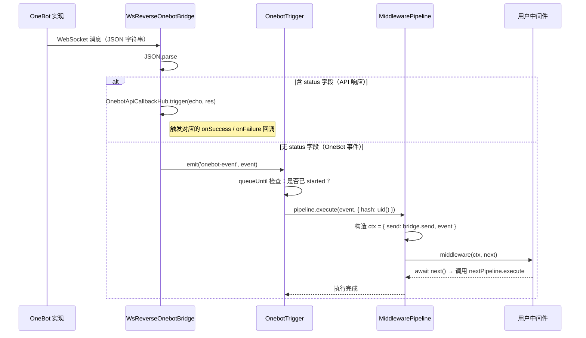
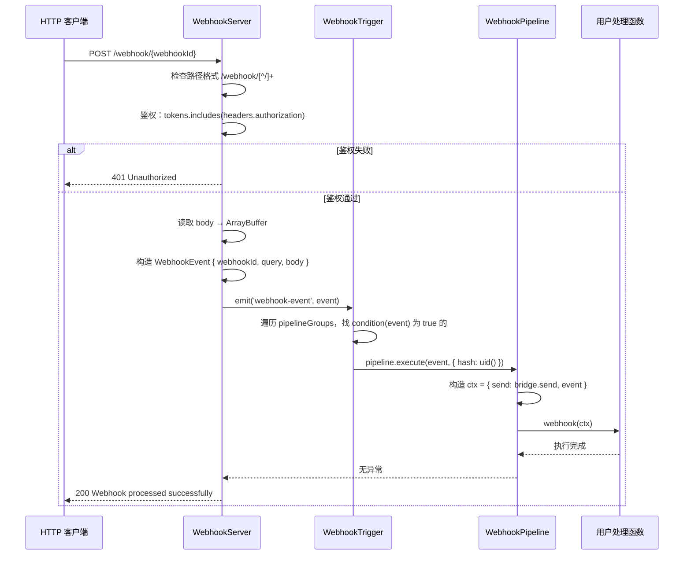
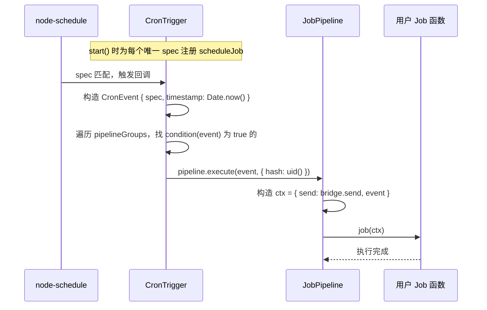
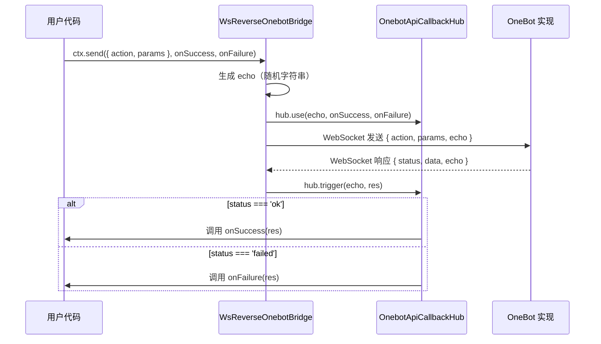

# 数据流

## OneBot 事件流



**鉴权**：`App` 向 OneBot 建立 WebSocket 连接时，若配置了 `token`，会在握手请求头中携带 `Authorization: Bearer <token>`。

**事件缓冲**：`OnebotTrigger.connect()` 时用 `queueUntil(() => this.#started, callback)` 包装事件监听器。`start()` 被调用前，所有到达的事件会缓冲在队列中，`start()` 后批量执行，确保不丢弃启动窗口期的事件。

---

## Webhook 事件流



**鉴权说明**：`WebhookServer` 检查 HTTP 请求的 `Authorization` 请求头，与初始化时传入的 `tokens` 数组做 `includes` 比较。若 `tokens` 为空数组则跳过鉴权。

**路由**：`WebhookTrigger` 为每个 `webhookId` 存储一个 `condition: (event) => event.webhookId === branchWebhookId`。收到事件后遍历所有 pipelineGroup，匹配的才执行。未匹配则抛出错误，WebhookServer 返回 500。

---

## 定时任务流



**Spec 去重**：`CronTrigger` 维护一个 `#specs: Set<Spec>`，同一 spec 只注册一个 `scheduleJob`。当多个 Job 使用相同 spec 时，触发器统一响应，并通过 `condition` 分发到各自的管道。

---

## API 响应回调流

`ctx.send` 调用后，请求通过 WebSocket 发出，响应通过 `OnebotApiCallbackHub` 异步回调：



---

## 错误处理

管道层统一捕获用户代码抛出的异常并写入日志，不会向上传播导致进程崩溃：

```typescript
// 三种 Pipeline 的共同模式
try {
  await this.#middleware(ctx, next)   // 或 #job / #webhook
} catch (err) {
  if (err instanceof Error) {
    logger.error(identifier + ' error: ' + err.message)
    logger.error(err.stack)
  } else {
    logger.error(identifier + ' error: ' + String(err))
  }
}
```

触发层调用 `pipeline.execute()` 时不 `await`，错误由 `.catch(() => null)` 静默处理，确保单条管道的异常不阻塞同一事件的其他管道。
