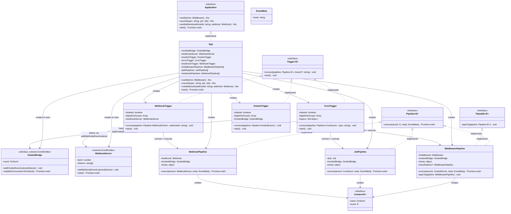

# 接口、类型与组件关系

## 核心类图



---

## 公开接口（`src/interfaces/`）

用户代码直接使用的类型，从 `aurorax` 包导出。

### `Application`（`src/app/interface.ts`）

`App` 类实现的接口，定义了框架的公开 API：

```typescript
interface Application {
  useMw(mw: Middleware): this
  useJob(spec: string, job: Job): this
  useWebhook(webhookId: string, webhook: Webhook): this
  start(): Promise<void>
}
```

### `Context<E>`（`src/interfaces/facade/facade.ts`）

用户代码在中间件、Job、Webhook 中收到的上下文对象：

```typescript
interface Context<E extends OnebotEvent | CronEvent | WebhookEvent> {
  readonly send: CtxSend
  readonly event: E
}
```

### 用户函数类型（`src/interfaces/facade/facade.ts`）

```typescript
// 中间件：接收 OnebotEvent，有 next() 控制流
type Middleware = (
  ctx: Readonly<Context<OnebotEvent>>,
  next: () => Promise<void>
) => Promise<void>

// 定时任务：接收 CronEvent，无 next()
type Job = (ctx: Readonly<Context<CronEvent>>) => Promise<void>

// Webhook 处理函数：接收 WebhookEvent，无 next()
type Webhook = (ctx: Context<WebhookEvent>) => Promise<void>
```

### `OnebotEvent`（`src/interfaces/onebot/event.ts`）

联合类型，由 `post_type` 区分：

```typescript
type OnebotEvent = MetaEvent | NoticeEvent | RequestEvent | MessageEvent
// 其中：
// MetaEvent    = LifecycleMetaEvent | HeartbeatMetaEvent
// NoticeEvent  = FriendAddNoticeEvent | GroupUploadNoticeEvent | ...（11 种）
// RequestEvent = FriendRequestEvent | GroupRequestEvent
// MessageEvent = PrivateMessageEvent | GroupMessageEvent
```

使用时通过 `post_type` 做类型收窄，TypeScript 会自动推断子类型的所有字段。

### `CronEvent`（`src/interfaces/cron/event.ts`）

```typescript
interface CronEvent {
  spec: Spec    // 触发本次任务的 cron 表达式
  timestamp: number  // 触发时间戳（ms），即 Date.now()
}
```

### `WebhookEvent`（`src/interfaces/webhook/event.ts`）

```typescript
interface WebhookEvent {
  webhookId: string       // 注册时的 webhookId，即 URL 路径的最后一段
  query: URLSearchParams  // URL 查询参数
  body: ArrayBuffer       // 原始请求体
}
```

---

## 内部接口（`src/internal/`）

框架内部使用，不对外导出。

### `CtxSend`（`src/internal/onebot-bridge/interface.ts`）

`ctx.send` 的类型，泛型保证 `params` 与 `action` 严格对应：

```typescript
type CtxSend = <T extends ApiActionName>(
  req: Omit<ApiRequest<T>, 'echo'>,
  onSuccess?: OnebotApiResCallback<ApiResponseStatus.OK, T>,
  onFailure?: OnebotApiResCallback<ApiResponseStatus.FAILED, T>
) => void
```

`echo` 字段由框架内部生成，不需要调用方传入，因此用 `Omit` 去掉。

### `OnebotBridge`（`src/internal/onebot-bridge/interface.ts`）

```typescript
interface OnebotBridge extends EventEmitter {
  addOnebotEventListener(listener: (event: OnebotEvent) => void): void
  send: CtxSend
  establishConnectionToOnebot(): Promise<void>
}
```

目前唯一实现是 `WsReverseOnebotBridge`（`src/internal/onebot-bridge/ws-reverse/bridge.ts`）。

### `Pipeline<E>` 和 `Pipeable<E>`（`src/internal/pipelines/interface.ts`）

```typescript
interface EventMeta {
  hash: string  // 每次事件触发时由触发层生成的随机 ID，用于日志关联
}

interface Pipeline<E> {
  execute(event: E, meta: EventMeta): Promise<void>
}

interface Pipeable<E> {
  pipeTo(pipeline: Pipeline<E>): void
}
```

`MiddlewarePipeline` 同时实现两者；`JobPipeline` 和 `WebhookPipeline` 只实现 `Pipeline`。

### `Trigger<E>`（`src/internal/triggers/interface.ts`）

```typescript
interface Trigger<E> {
  connect(pipeline: Pipeline<E>, branch?: string): void
  start(): void
}
```

`branch` 的语义由各实现决定：`CronTrigger` 用 `spec` 字符串，`WebhookTrigger` 用 `webhookId`，`OnebotTrigger` 不使用 `branch`（所有 Onebot 事件都进同一条管道链）。

### `ApiRequest<T>`（`src/interfaces/onebot/req.ts`）

```typescript
interface ApiRequest<T extends ApiActionName> {
  action: T
  params: RequestParamsMap[T]  // 按 action 推断的精确 params 类型
  echo: string
}
```

`RequestParamsMap` 映射了所有 OneBot 11 API 动作到对应的参数类型，确保 `params` 字段类型安全。

### `ApiResponse<S, T>`（`src/interfaces/onebot/res.ts`）

```typescript
interface ApiResponse<S extends ApiResponseStatus, T extends ApiActionName> {
  status: S
  data: ResponseDataMap[T]  // 按 action 推断的返回数据类型
  echo: string
}
```
