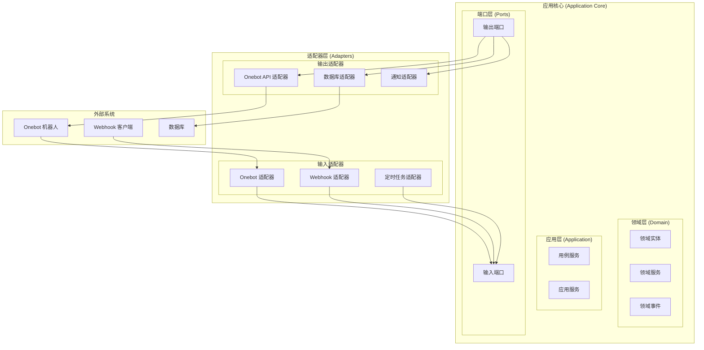

# 六边形架构分析

## 当前架构的六边形特征分析

### ✅ 符合六边形架构的方面

#### 1. 端口（Ports）设计
```typescript
// 应用端口 - 定义业务接口
export interface IApp {
  useMw (mw: Middleware): this
  useJob (spec: string, job: Job): this
  useWebhook (webhookId: string, webhook: Webhook): this
  start (): void
}

// 用户代码端口 - 定义业务逻辑接口
export type Middleware = (ctx: Readonly<Context<OnebotEvent>>, next: () => Promise<void>) => Promise<void>
export type Job = (ctx: Readonly<Context<CronEvent>>) => Promise<void>
export type Webhook = (ctx: Context<WebhookEvent>) => Promise<void>
```

#### 2. 适配器（Adapters）设计
- **OnebotBridge**: 适配 Onebot 外部系统
- **WebhookServer**: 适配 HTTP Webhook 外部系统
- **CronTrigger**: 适配系统定时器

#### 3. 依赖倒置
- 应用核心不直接依赖外部系统
- 通过接口抽象外部依赖
- 外部系统通过适配器接入

### ❌ 不完全符合六边形架构的方面

#### 1. 业务逻辑与基础设施混合
```typescript
// 问题：App 类直接创建具体实现
export class App implements IApp {
  readonly #onebotBridge: OnebotBridge  // 具体实现
  readonly #webhookServer: WebhookServer  // 具体实现
  readonly #onebotTrigger: OnebotTrigger  // 具体实现
  
  constructor ({ onebot, webhook }: AppOptions) {
    this.#onebotBridge = createOnebotBridge({  // 直接创建
      type: onebot.type,
      url: onebot.url,
      token: onebot.token,
    })
    // ...
  }
}
```

#### 2. 缺少领域模型
- 没有明确的业务领域实体
- 业务逻辑分散在各个管道中
- 缺少领域服务层

#### 3. 端口定义不够清晰
- 输入端口和输出端口混合在一起
- 缺少明确的业务用例端口

## 改进建议

### 1. 重新设计端口层



### 2. 定义清晰的端口接口

```typescript
// 输入端口 - 定义应用如何接收外部事件
interface EventInputPort {
  onOnebotEvent(event: OnebotEvent): Promise<void>
  onWebhookEvent(event: WebhookEvent): Promise<void>
  onCronEvent(event: CronEvent): Promise<void>
}

// 输出端口 - 定义应用如何与外部系统交互
interface OnebotOutputPort {
  sendMessage(userId: number, message: string): Promise<void>
  sendGroupMessage(groupId: number, message: string): Promise<void>
}

interface NotificationOutputPort {
  notify(message: string): Promise<void>
}

// 用例端口 - 定义业务用例
interface MiddlewareUseCase {
  execute(ctx: MiddlewareContext): Promise<void>
}

interface JobUseCase {
  execute(ctx: JobContext): Promise<void>
}
```

### 3. 重构应用核心

```typescript
// 应用服务 - 协调用例和端口
export class ApplicationService {
  constructor(
    private eventInputPort: EventInputPort,
    private onebotOutputPort: OnebotOutputPort,
    private middlewareUseCase: MiddlewareUseCase,
    private jobUseCase: JobUseCase
  ) {}
  
  async handleOnebotEvent(event: OnebotEvent): Promise<void> {
    const ctx = this.createMiddlewareContext(event)
    await this.middlewareUseCase.execute(ctx)
  }
  
  async handleCronEvent(event: CronEvent): Promise<void> {
    const ctx = this.createJobContext(event)
    await this.jobUseCase.execute(ctx)
  }
}
```

### 4. 实现适配器

```typescript
// Onebot 输入适配器
export class OnebotInputAdapter implements EventInputPort {
  constructor(
    private applicationService: ApplicationService,
    private onebotBridge: OnebotBridge
  ) {
    this.onebotBridge.addOnebotEventListener(
      (event) => this.applicationService.handleOnebotEvent(event)
    )
  }
}

// Onebot 输出适配器
export class OnebotOutputAdapter implements OnebotOutputPort {
  constructor(private onebotBridge: OnebotBridge) {}
  
  async sendMessage(userId: number, message: string): Promise<void> {
    return this.onebotBridge.send({
      action: 'send_private_msg',
      params: { user_id: userId, message }
    })
  }
}
```

## 当前架构的六边形程度评分

| 方面 | 评分 | 说明 |
|------|------|------|
| 端口抽象 | 6/10 | 有接口定义，但不够清晰分离 |
| 适配器实现 | 7/10 | 有适配器概念，但混合在核心中 |
| 依赖倒置 | 5/10 | 部分实现，但核心直接依赖具体实现 |
| 业务逻辑隔离 | 4/10 | 业务逻辑分散，缺少领域层 |
| 可测试性 | 6/10 | 部分可测试，但依赖注入不够完善 |
| 可扩展性 | 7/10 | 有扩展点，但结构不够清晰 |

**总体评分: 5.8/10** - 部分符合六边形架构，但需要重构

## 结论

当前的设计**部分符合**六边形架构的原则：

**优点：**
- 有端口和适配器的概念
- 实现了依赖倒置的部分原则
- 模块化设计良好
- 有清晰的扩展点

**需要改进：**
- 业务逻辑与基础设施混合
- 缺少清晰的领域层
- 端口定义不够明确
- 依赖注入不够完善

**建议：**
如果要完全符合六边形架构，建议进行重构，将业务逻辑从基础设施中分离出来，建立清晰的领域层和端口层。
