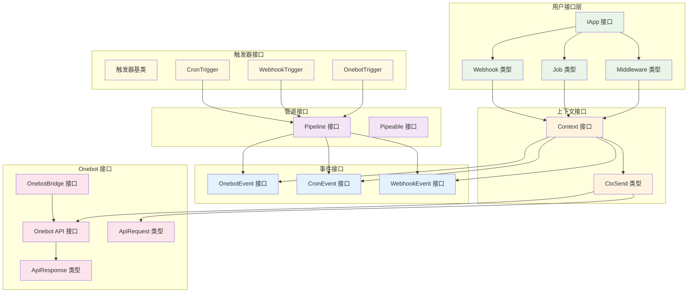
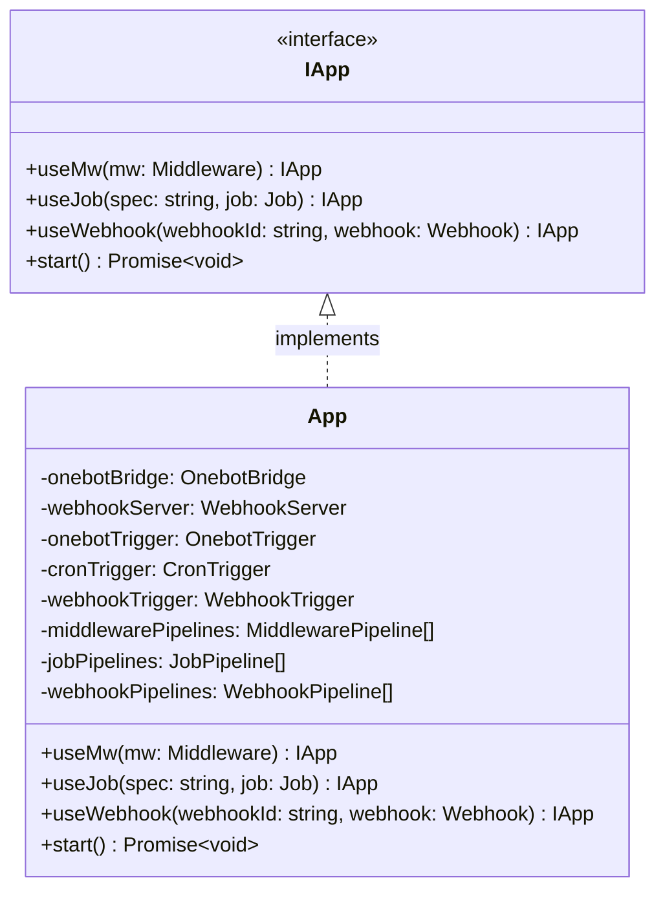
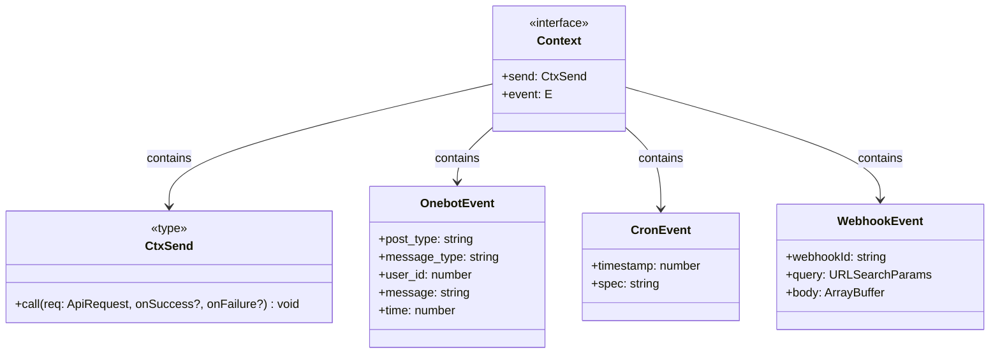
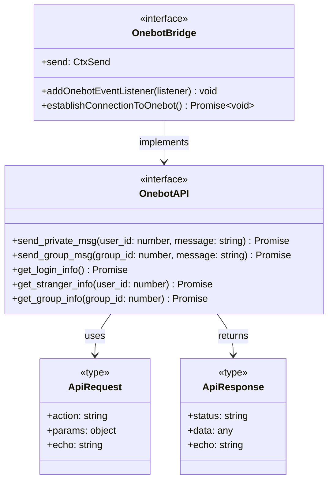
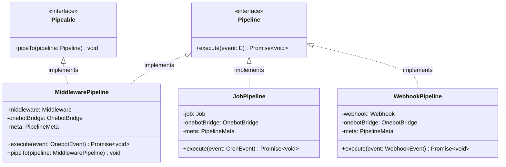
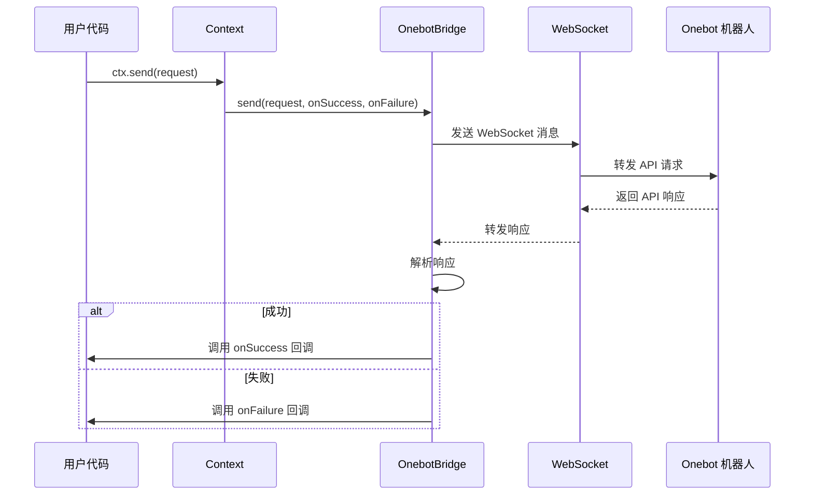
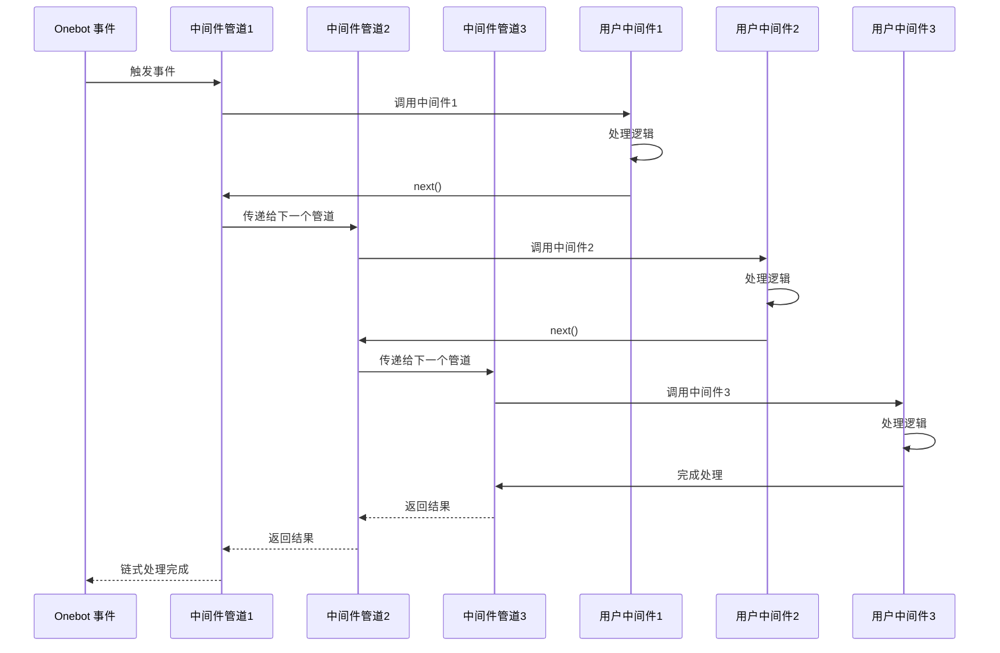

# 接口与 API 图

## 核心接口关系图



## 详细接口定义

### 1. 应用接口 (IApp)



### 2. 上下文接口 (Context)



### 3. Onebot API 接口



### 4. 管道接口



## API 调用流程图

### Onebot API 调用流程



### 中间件链式调用流程



## 类型安全设计

### 泛型接口设计

```typescript
// 上下文接口使用泛型确保类型安全
interface Context<E extends OnebotEvent | CronEvent | WebhookEvent> {
  readonly send: CtxSend
  readonly event: E
}

// 管道接口使用泛型
interface Pipeline<E> {
  execute(event: E): Promise<void>
}

// 用户函数类型定义
type Middleware = (ctx: Readonly<Context<OnebotEvent>>, next: () => Promise<void>) => Promise<void>
type Job = (ctx: Readonly<Context<CronEvent>>) => Promise<void>
type Webhook = (ctx: Context<WebhookEvent>) => Promise<void>
```

### API 类型安全

```typescript
// Onebot API 请求类型安全
type CtxSend = <T extends ApiActionName>(
  req: Omit<ApiRequest<T>, 'echo'>,
  onSuccess?: OnebotApiResCallback<ApiResponseStatus.OK, T>,
  onFailure?: OnebotApiResCallback<ApiResponseStatus.FAILED, T>
) => void

// 回调函数类型安全
type OnebotApiResCallback<
  S extends ApiResponseStatus = ApiResponseStatus, 
  T extends ApiActionName = ApiActionName,
> = (res: Omit<ApiResponse<S, T>, 'echo'>) => void
```

## 扩展接口设计

### 新增触发器接口

```typescript
interface Trigger<E> {
  connect(pipeline: Pipeline<E>): void
  start(): void
  stop(): void
}
```

### 新增管道接口

```typescript
interface CustomPipeline<E> extends Pipeline<E> {
  // 自定义管道方法
  customMethod(): void
}
```

### 新增桥接器接口

```typescript
interface CustomBridge {
  addEventListener(listener: (event: CustomEvent) => void): void
  send(data: any): Promise<any>
  connect(): Promise<void>
}
```

## 接口设计原则

1. **单一职责**: 每个接口只负责一个特定功能
2. **开闭原则**: 对扩展开放，对修改关闭
3. **里氏替换**: 子类可以替换父类
4. **接口隔离**: 接口应该小而专一
5. **依赖倒置**: 依赖抽象而不是具体实现
6. **类型安全**: 充分利用 TypeScript 的类型系统
