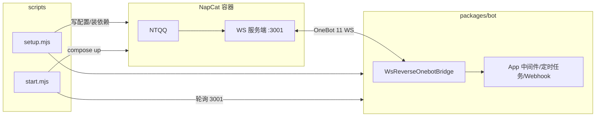

# @aurorax/aurorax-bot

[aurorax](../..) + [NapCat](https://github.com/NapNeko/NapCatQQ) 一键开箱的完整 QQ Bot 项目，作为 aurorax 主库的 workspace 子包。

## 架构



aurorax 的 `ws-reverse` 作为 WS 客户端，连接 NapCat 预置的 OneBot 11 WS 服务端（`napcat/config/onebot11.json`，端口 3001），开箱免 WebUI 配置。

## 要求

- [Bun](https://bun.sh/)
- [Docker](https://docs.docker.com/get-docker/)

## 快速开始

在仓库根目录（workspace 根）执行：

```bash
bun run bot:setup   # 拉取 NapCat 镜像 + 安装依赖 + 生成 .env
bun run bot:start   # 启动 NapCat + 等待 WS 就绪 + 启动 Bot
```

或进入子包直接执行：

```bash
cd packages/bot
bun run setup
bun start
```

首次启动后扫码登录 QQ：

```bash
bun run bot:napcat:logs   # 或 cd packages/bot && bun run napcat:logs
```

登录后若 WS 服务端未自动启用（NapCat 登录后生成 `napcat_<QQ>.json` 覆盖默认配置），请在 WebUI http://localhost:6099 的「网络配置」中启用名为 `aurorax` 的 WebSocket 服务端（端口 3001）。

登录成功后，向 Bot 发送 `ping`，收到 `pong` 即链路打通。

## 常用命令

| 命令 | 说明 |
|---|---|
| `bun run setup` | 初始化（compose pull + bun install + .env） |
| `bun start` | 一键启动完整 Bot |
| `bun run dev` | 开发模式（Bot 以 `--watch` 重启） |
| `bun run napcat:logs` | 查看 NapCat 日志（扫码登录） |

## 目录结构

```
├── packages/bot/        # Bot 业务代码（src/index.ts）
├── napcat/config/       # OneBot 11 预置配置
├── docker-compose.yml   # NapCat 服务（6099 WebUI / 3001 WS）
├── scripts/             # setup / start / dev 编排脚本
└── .env.example         # WS 地址 / Token / 日志级别
```

## 配置

- Bot 连接：`.env` 中 `AURORAX_WS_URL` / `AURORAX_WS_TOKEN`
- Token 如需启用，同步修改 `napcat/config/onebot11.json` 的 `token` 字段
- NapCat WebUI：http://localhost:6099

## 编写 Bot

业务代码在 `packages/bot/src/index.ts`，参考 [aurorax 文档](https://homearchbishop.github.io/aurorax/)。
